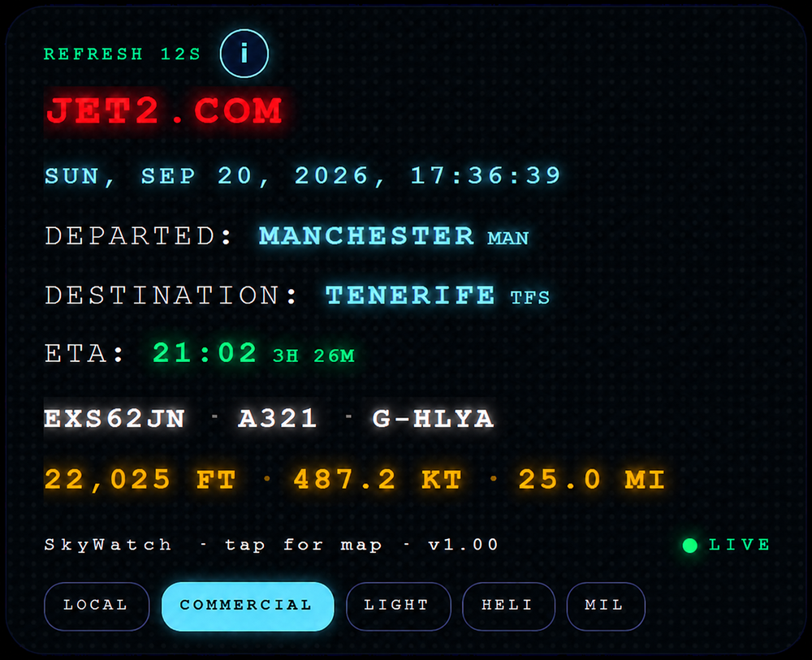
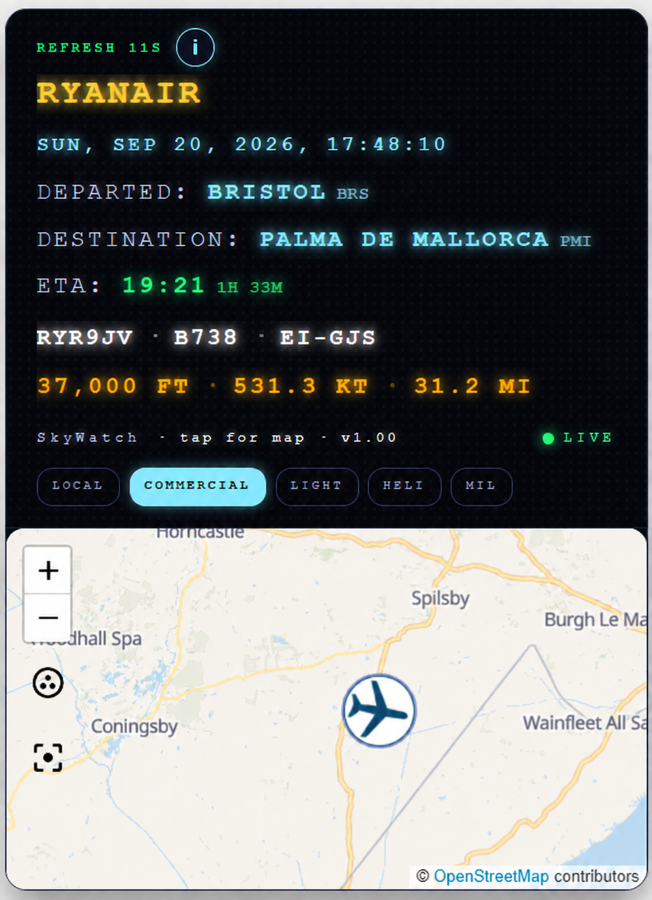
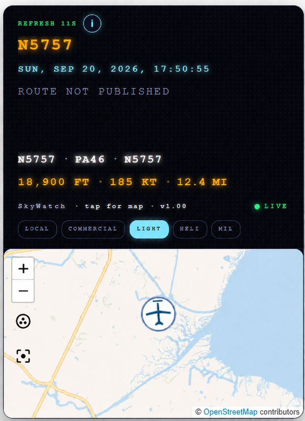
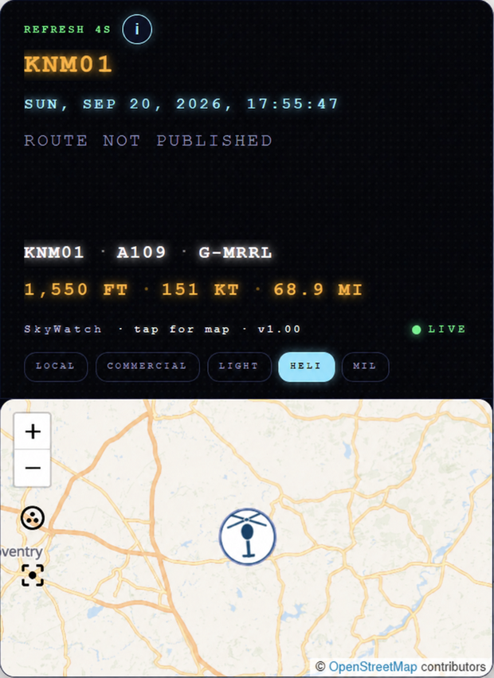
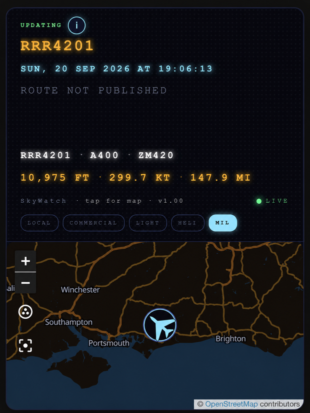
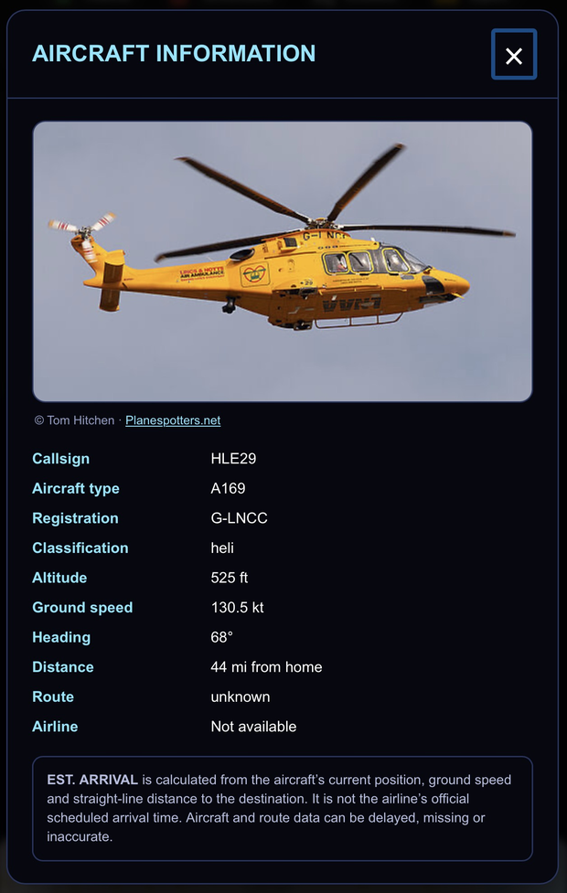

# SkyWatch Card

A departure-board style Home Assistant card showing the nearest aircraft to your home, live.




- Airline name lit in its own brand colour, falling back to the callsign
- Where the flight departed and where it's going, with a calculated arrival time
- Callsign, aircraft type, registration, altitude, ground speed and distance from you
- Filter chips: LOCAL, COMMERCIAL, LIGHT, HELI, MIL
- Tap the card for a live map, with the aircraft marker drawn as an airliner, light
  aircraft, helicopter or jet and rotated to its heading
- Map and marker switch between light and dark at sunrise and sunset
- Information panel with a photograph of the actual aircraft, by registration

No account, no API key, no subscription. Free community ADS-B data and your own
Home Assistant home location.

## Screenshots

Tap the card and a live map drops down beneath it.



The filter chips change what it looks for. Helicopters and military traffic are sparse, so
those two search much wider than the 25 nm local scan — the distance tells you how far away
it is.

| Light aircraft | Helicopter | Military |
|---|---|---|
|  |  |  |

Each category gets its own map marker, rotated to the aircraft's heading. Light aircraft,
military and many cargo flights have no published route, so those show "Route not published".
The military shot above was taken after sunset — the map and the marker follow `sun.sun`, so
they switch to dark together without any setting.

Tap the round **i** button for the full detail panel, including a photograph of that exact
aircraft matched by its registration, with the photographer credited and linking back to
the original.



## Install

### 1. Sensors

Copy `skywatch.yaml` into your Home Assistant `packages` folder.

If you don't use packages yet, add this to `configuration.yaml` and create a folder
called `packages` beside it:

```yaml
homeassistant:
  packages: !include_dir_named packages
```

Restart Home Assistant. After a minute `sensor.nearest_plane` will show a callsign,
or nothing if the sky is quiet.

The two raw sensors hold large attributes and should be kept out of the database.
Add this to `configuration.yaml`, merging it with any `recorder:` block you already have:

```yaml
recorder:
  exclude:
    entities:
      - sensor.nearest_plane_raw
      - sensor.nearest_plane_mil_raw
      - sensor.nearest_plane_wide_raw
```

### 2. Card

**HACS:** HACS → three dots → Custom repositories → add this repository with type
*Dashboard* → install SkyWatch Card.

**Manual:** copy `skywatch-card.js` into `/config/www/`, then Settings → Dashboards →
three dots → Resources → Add resource, URL `/local/skywatch-card.js`, type
*JavaScript module*.

Add the card to a dashboard (Edit → Add card → Manual):

```yaml
type: custom:skywatch-card
```

## Card options

Every option below is optional; these are the defaults.

```yaml
type: custom:skywatch-card
entity: sensor.nearest_plane
route_entity: sensor.nearest_plane_route
filter_entity: input_select.nearest_plane_filter
refresh_entity: sensor.nearest_plane_raw
refresh_interval: 15
title: SKYWATCH
map_zoom: 8
map_theme: auto      # auto | light | dark
```

`map_theme: auto` follows `sun.sun`, so the map is light by day and dark at night.

## How the filters work

| Chip | What it searches |
|---|---|
| LOCAL | Nearest aircraft of any kind within 25 nm of home |
| COMMERCIAL | Nearest airliner or cargo flight within 25 nm |
| LIGHT | Nearest light aircraft within 25 nm |
| HELI | Nearest helicopter within 250 nm |
| MIL | Nearest military aircraft currently tracked, up to about 745 miles |

HELI and MIL search wider on purpose. Helicopters and military traffic are sparse, so a
25 nm search usually finds nothing; the distance shown tells you how far away it is.
The wide helicopter scan only runs while HELI is selected.

Changing filters costs no extra API call — the aircraft already fetched are re-sorted
locally.

## Scan radius

Set by the last number in the first URL in `skywatch.yaml` (`/dist/25`), in nautical
miles. The API allows up to 250. Larger radii return thousands of aircraft, so leave the
main scan small and let HELI and MIL do the wide searching.

## Roadmap

Setup currently needs a YAML package and a restart. A Home Assistant integration with a
proper config flow is in progress and will replace that step — install, answer a few
questions, done. The card itself won't change when that lands.

The YAML package is a normal, supported way to configure Home Assistant, not a
workaround. If you haven't used packages before, the steps above cover it from scratch.

## What to expect

- **Route not published** — the route database covers scheduled airline callsigns.
  Light aircraft, military, positioning and many cargo flights have no published route.
- **The arrival time is calculated, not scheduled.** It comes from the aircraft's
  current position and ground speed against the destination airport, in a straight line,
  so it usually runs a few minutes early of the real touchdown. It is not the airline's
  timetable.
- **Classification is a heuristic.** Categories come from the ADS-B emitter category, the
  military flag and the airline-style callsign pattern. It is right most of the time and
  will occasionally put an unusual aircraft in the wrong group.
- **Coverage varies.** Positions come from volunteer receivers. Low-level aircraft in
  thinly covered areas may not appear at all.
- Because the sensor carries `latitude` and `longitude`, the aircraft also shows on any
  Home Assistant map dashboard. Hide the entity there if you'd rather it didn't.

## Privacy

Your home coordinates are sent to adsb.fi as the centre of the search — that is how the
service returns nearby aircraft, and it is the only personal data involved. Callsigns of
nearby aircraft go to adsbdb for route lookups, and registrations to Planespotters when
you open the information panel. Nothing is sent anywhere else, and nothing is stored
outside your own Home Assistant.

## Data sources

- Aircraft positions: [adsb.fi open data](https://github.com/adsbfi/opendata), free for
  personal, non-commercial use, rate limited to one request per second
- Routes and airline names: [adsbdb](https://www.adsbdb.com/)
- Aircraft photographs: [Planespotters.net](https://www.planespotters.net/photo/api),
  shown with the photographer's credit and linking back to the photo page as their terms
  require

These are volunteer-run services. If you get use out of this, consider running a receiver
and feeding them — that's where the data comes from.

## Licence

MIT
